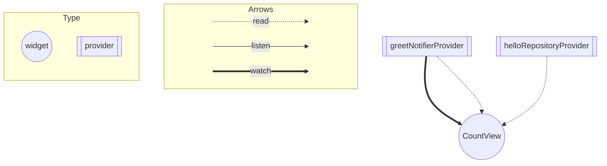

# riverpod_graph_example

```bash
add flutter_rivflutter pub add \
flutter_riverpod \
riverpod_annotation \
dev:riverpod_generator \
dev:build_runner \
dev:custom_lint \
dev:riverpod_linterpod
```

create greet.md
```bash
dart pub global run riverpod_graph:riverpod_graph > greet.md
```

